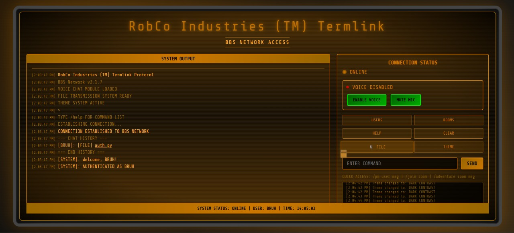
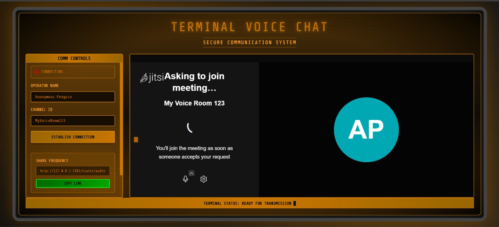
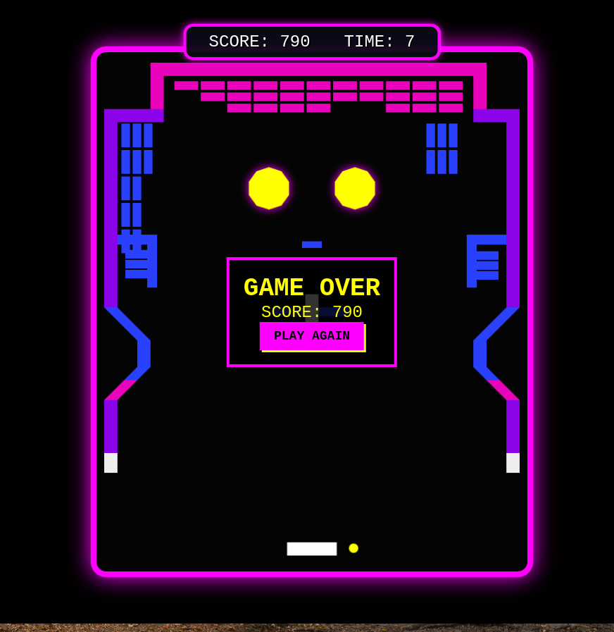
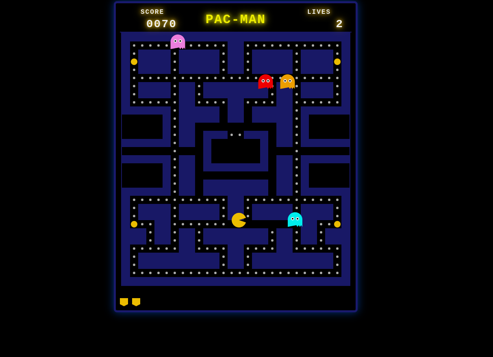
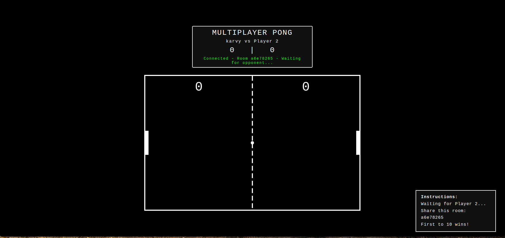
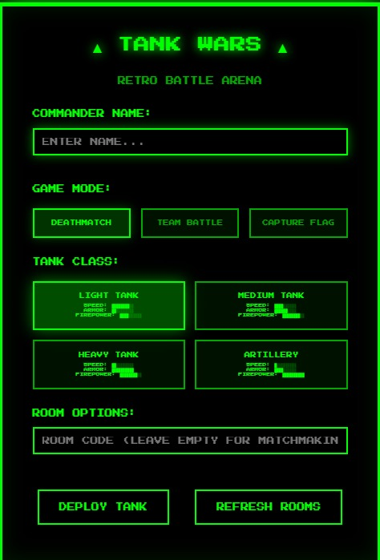
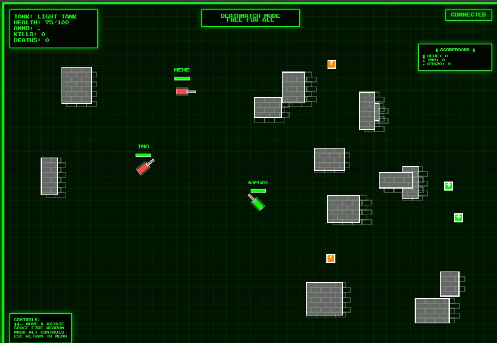
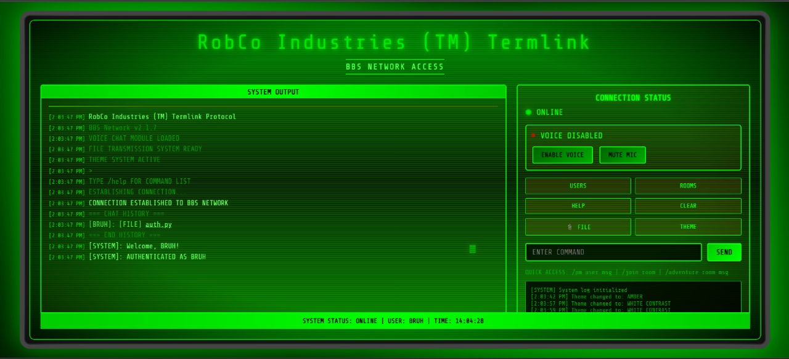
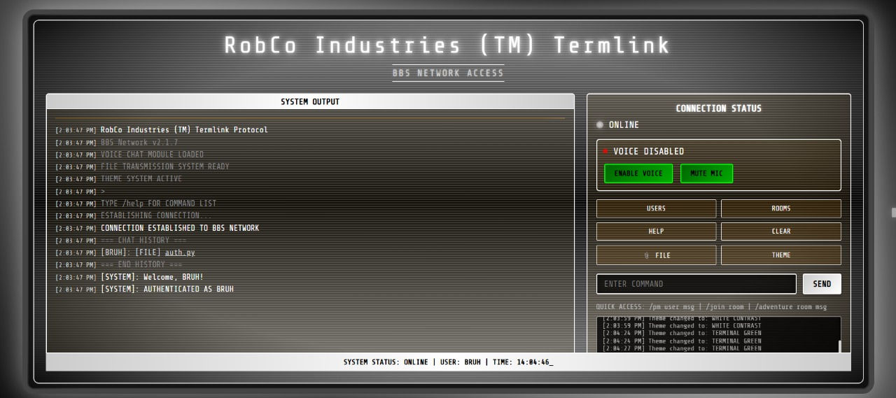
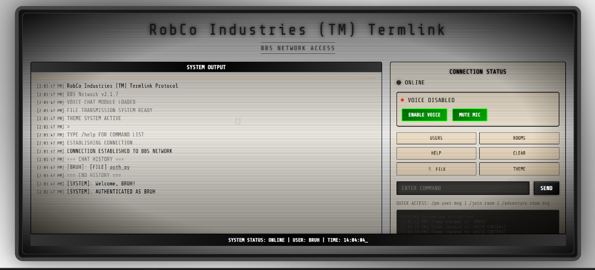

# RetroHub BBS

## DEMO VIDEO
https://drive.google.com/drive/folders/1ljONBu0t3NAS0TL_Te2H46Kd87K0QJlv?usp=sharing

A modern reimagining of classic Bulletin Board Systems (BBS) built with contemporary web technologies. RetroHub combines the nostalgic social experience of old-school BBSes with modern features like real-time chat, multiplayer games, AI-powered adventures, and voice communication.



## Features

### Core Communication

- **Real-time Chat System**: Socket.IO-powered messaging with support for global, private, and room-based conversations
- **Topic-Aware Messaging**: AI-powered topic analysis that automatically suggests relevant chat rooms
- **File Sharing**: Upload and share files with other users in any chat context
- **Voice Chat**: Integrated Jitsi Meet voice rooms for real-time audio communication
- **User Authentication**: Secure user registration and login system with session management

<details>
<summary>🎙️ Voice Chat Interface</summary>



</details>

### Gaming Platform

- **Retro Arcade Games**:
  - **Gee-Bee**: Classic breakout-style game with retro aesthetics
  - **Pac-Man**: Full recreation of the classic arcade game

 

- **Multiplayer Games**:
  - **Pong**: Real-time multiplayer Pong with spectator mode
  - **Tank Wars**: Advanced multiplayer tank battle game featuring:






    - Multiple tank classes (Light, Medium, Heavy, Artillery)
    - Various game modes (Deathmatch, Team Battle, Capture the Flag)
    - Real-time physics and combat systems
    - Team-based gameplay with respawn mechanics

### AI-Powered Adventures

- **Interactive Text Adventures**: AI Dungeon Master powered by Mistral LLM
- **Character Creation**: Create custom characters with stats and abilities
- **Turn-based Combat**: Structured combat system with dice rolling mechanics
- **Collaborative Storytelling**: Multiple players can join adventures together
- **Dynamic Narrative**: AI generates contextual story content and responses

### Technical Architecture

- **Async WebSocket Server**: Built on aiohttp and Socket.IO for real-time communication
- **SQLite Database**: Persistent storage for users, messages, and game data
- **Modular Design**: Clean separation between chat, games, and adventure systems
- **Cross-Platform Client**: Web-based interface accessible from any modern browser

## Visual Themes

RetroHub offers multiple visual themes to enhance the retro BBS experience:

 

 

## Installation

NOTE: For the AI functionality, you need to add a MistralAI API Key which you need to use either as environment variable or save it in a file named `secrets.txt`

### Prerequisites

- Python 3.8+
- Modern web browser with WebSocket support

### Dependencies

Install the required Python packages:

```bash
pip install aiohttp
pip install python-socketio
pip install aiohttp-session
pip install bidict
pip install mistralai
pip install openai
pip install websockets
```

### Configuration

1. Set up your AI API keys in `secrets.txt` for the adventure system
2. Configure authentication settings in `auth.py`
3. Initialize the databases by running the server (they'll be created automatically)

## Usage

### Starting the Server

Run the main server:

```bash
python server.py
```

The server will start on the default port and initialize all necessary databases.

### Accessing the Platform

1. Open your web browser and navigate to the server address
2. Register a new account or log in with existing credentials
3. Choose from various activities:
   - Join chat rooms and conversations
   - Play single-player retro games
   - Start or join multiplayer games
   - Begin AI-powered text adventures
   - Join voice chat rooms

### Command Line Client

For testing or automation, use the command-line client:

```bash
python client.py
```

## Project Structure

```text
osdhack/
├── server.py                 # Main WebSocket server
├── client.py                 # Command-line client
├── auth.py                   # Authentication system
├── topic_analyzer.py         # AI-powered chat topic analysis
├── static/                   # Web frontend files
│   ├── index.html            # Main chat interface
│   ├── audio.html            # Voice chat interface
│   └── *.css, *.js          # Styling and client-side logic
├── adventure/                # Text adventure system
│   ├── handler.py            # Adventure game coordinator
│   ├── ai_dm.py              # AI Dungeon Master
│   ├── player.py             # Player character management
│   ├── characters.py         # Character creation and stats
│   └── dice.py               # Dice rolling mechanics
├── games/                    # Single-player retro games
│   ├── gee-bee/              # Breakout-style game
│   └── pacman/               # Pac-Man recreation
├── multiplayer/              # Multiplayer game servers
│   ├── pong/                 # Real-time Pong game
│   └── Tank/                 # Tank Wars battle game
└── persistence/              # Database management
    ├── chatdb.py             # Chat message storage
    ├── authdb.py             # User authentication
    └── *.sql                 # Database schemas
```

## Game Modes

### Single Player

- **Gee-Bee**: Brick-breaking game with power-ups and multiple levels
- **Pac-Man**: Navigate mazes, collect dots, avoid ghosts

### Multiplayer

- **Pong**: Classic paddle game for 2 players with real-time physics
- **Tank Wars**: Strategic tank combat with various game modes and team play

### Cooperative

- **AI Adventures**: Collaborative storytelling with multiple players and AI narration

## Features in Detail

### Chat System

- Global chat for server-wide conversations
- Private messaging between users
- Topic-based room suggestions using AI analysis
- File upload and sharing capabilities
- Message history and persistence

### Adventure System

- Character creation with customizable stats
- Turn-based combat with dice mechanics
- AI-generated storylines and responses
- Multi-player adventure support
- Persistent character progression

### Voice Integration

- Jitsi Meet integration for voice rooms
- Room-based voice chat coordination
- Easy-to-use web interface for audio communication

## Contributing

This project welcomes contributions in several areas:

- Additional retro games and game modes
- Enhanced AI adventure features
- UI/UX improvements for the web interface
- Performance optimizations
- New multiplayer game types

## License

See the LICENSE file for licensing information.

## Technical Notes

### Architecture Highlights

- **Event-driven Design**: Asynchronous event handling for all real-time features
- **Modular Components**: Each major feature (chat, games, adventures) is self-contained
- **Database Abstraction**: Clean database interfaces for easy maintenance and testing
- **WebSocket Communication**: Efficient real-time data exchange
- **AI Integration**: Seamless LLM integration for intelligent features

### Performance Considerations

- Connection pooling for database operations
- Rate limiting for AI API calls
- Efficient message broadcasting for chat rooms
- Optimized game state synchronization for multiplayer games

RetroHub represents a bridge between the community-focused spirit of classic BBSes and the capabilities of modern web technology, creating a unique social gaming platform that celebrates both nostalgia and innovation.
Submission for OSDHACK'25
